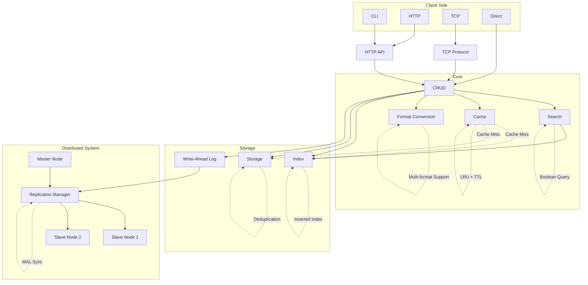

# PicS - Picture Indexed Cache with blob store System
> Will build with Rust

```mermaid
graph TB
  subgraph "Client Side"
    A0[CLI]
    A1[HTTP]
    A2[TCP]
    A3[Direct]
  end
  
  B0[HTTP API]
  B1[TCP Protocol]
  
  subgraph "Core"
    crud[CRUD]
    search[Search]
    cache[Cache]
    format[Format Conversion]
  end
  
  subgraph "Storage"
    index[Index]
    store[Storage]
    wal[Write-Ahead Log]
  end
  
  subgraph "Distributed System"
    MASTER[Master Node]
    SLAVE1[Slave Node 1]
    SLAVE2[Slave Node 2]
    REPL[Replication Manager]
  end
  
  %% ===== Connection Relationships =====
  
  %% Client to Protocol Layer
  A0 --> B0
  A1 --> B0
  A2 --> B1
  A3 --> crud
  
  %% Protocol Layer to Core
  B0 --> crud
  B1 --> crud
  
  %% Core Engine Internal Flow
  crud --> search
  crud --> cache
  crud --> format
  search --> index
  cache -.->|Cache Miss| index
  cache -.->|Cache Miss| store
  
  %% Core to Storage Layer
  crud --> index
  crud --> store
  crud --> wal
  
  %% Distributed Replication
  MASTER --> REPL
  REPL --> SLAVE1
  REPL --> SLAVE2
  wal --> REPL
  
  cache -.->|LRU + TTL| cache
  store -.->|Deduplication| store
  index -.->|Inverted Index| index
  search -.->|Boolean Query| search
  format -.->|Multi-format Support| format
  REPL -.->|WAL Sync| REPL
```
